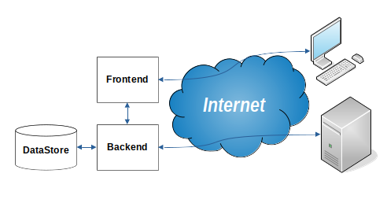

# OTIN - One Time Info
Система одноразового доступа к *информации*

## ТЗ
### Предназначение
Передача *информации* без возможности повторной передачи.
В качестве *информации* могут выступать любые данные:
* текст
* гиперссылка
* картинка
* файл

### Задачи
* Отдавать *информацию* только тем, кому она предназначена
* Проверять пользовательские данные, с целью исключать несанкционированный доступ к *информации*
* Предотвращать попытки несанкционированного доступа к *информации*
* Уведомлять пользователя о невозможности повторной выдачи *информации* перед её выдачей
* Вести журнал выданной *информации* для административных целей (не для общего доступа)
* Удалять *информацию* незамедлительно, после её выдачи пользователю
* При повторном запросе к *информации* иметь возможность
    * уведомлять о том, когда она была выдана
    * реагировать так, как будто этой *информации* не было

### Способы авторизации
Авторизация производится всеми доступными для приложения способами.

Для получения данных используются 2 режима
* **Автоматический** режим максимально защищенный, в котором используется методы авторизации по ключам сессии
* **Ручной режим** упрощенный с целью предоставить доступ к данным имея возможность ввести данные авторизации с клавиатуры

### Хранение данных
Все данные должны храниться централизованно, с невозможностью получить доступ к *информации* напрямую из вне приложения

### Архитектура приложения

Приложение разделено на 3 части
* **Frontend** предназначен для взаимодействия с пользователем. *Frontend* передает запросы в *Backend*, и преобразует ответы в удобную для восприятия пользователем форму
* **Backend** реализует основной функционал приложения. Имеет возможность принимать запросы как от *Frontend*, так и от других служб.
* **DataStore** База данных с *информацией*, журналом аудита и данными для работы приложения. Взаимодействует только с *Backend*, и не имеет возможности других подключений

### Frontend
#### Задачи
* Предоставлять удобный для восприятия интерфейс
* Дать возможность ввести данные авторизации для передачи их в *Backend*
* Предоставить вывод *информации* пользователю в удобной для восприятия форме

### Backend
#### Задачи
* Проверить данные авторизации, переданные напрямую, либо через *Frontend*
* Проверить актуальность и наличие *информации* в *DataStore*
* Выдать *информацию* либо описание о невозможности её выдачи в определенном формате (JSON)

### DataStore
#### Задачи
* Предоставлять доступ к данным только для *Backend*
* Предотвращать иные попытки доступа к данным
* Реплицировать данные, для возможности горизонтального масштабирования приложения

### Интерфейс доступа к *Backend*
REST API (формат: текстовый, json)
